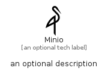

# Minio


```text
simpleicons/M/Minio
```

```text
include('simpleicons/M/Minio')
```


| Illustration | Minio |
| :---: | :---: |
|  |  |


## Sprites
The item provides the following sriptes:

- `<$MinioXs>`
- `<$MinioSm>`
- `<$MinioMd>`
- `<$MinioLg>`


## Minio

### Load remotely
```plantuml
@startuml
' configures the library
!global $LIB_BASE_LOCATION="https://raw.githubusercontent.com/tmorin/plantuml-libs/master/distribution"

' loads the library's bootstrap
!include $LIB_BASE_LOCATION/bootstrap.puml

' loads the package bootstrap
include('simpleicons/bootstrap')

' loads the Item which embeds the element Minio
include('simpleicons/M/Minio')

' renders the element
Minio('Minio', 'Minio', 'an optional tech label', 'an optional description')
@enduml
```

### Load locally
```plantuml
@startuml
' configures the library
!global $INCLUSION_MODE="local"
!global $LIB_BASE_LOCATION="../.."

' loads the library's bootstrap
!include $LIB_BASE_LOCATION/bootstrap.puml

' loads the package bootstrap
include('simpleicons/bootstrap')

' loads the Item which embeds the element Minio
include('simpleicons/M/Minio')

' renders the element
Minio('Minio', 'Minio', 'an optional tech label', 'an optional description')
@enduml
```

