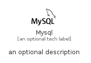

# Mysql


```text
simpleicons/M/Mysql
```

```text
include('simpleicons/M/Mysql')
```


| Illustration | Mysql |
| :---: | :---: |
|  |  |


## Sprites
The item provides the following sriptes:

- `<$MysqlXs>`
- `<$MysqlSm>`
- `<$MysqlMd>`
- `<$MysqlLg>`


## Mysql

### Load remotely
```plantuml
@startuml
' configures the library
!global $LIB_BASE_LOCATION="https://raw.githubusercontent.com/tmorin/plantuml-libs/master/distribution"

' loads the library's bootstrap
!include $LIB_BASE_LOCATION/bootstrap.puml

' loads the package bootstrap
include('simpleicons/bootstrap')

' loads the Item which embeds the element Mysql
include('simpleicons/M/Mysql')

' renders the element
Mysql('Mysql', 'Mysql', 'an optional tech label', 'an optional description')
@enduml
```

### Load locally
```plantuml
@startuml
' configures the library
!global $INCLUSION_MODE="local"
!global $LIB_BASE_LOCATION="../.."

' loads the library's bootstrap
!include $LIB_BASE_LOCATION/bootstrap.puml

' loads the package bootstrap
include('simpleicons/bootstrap')

' loads the Item which embeds the element Mysql
include('simpleicons/M/Mysql')

' renders the element
Mysql('Mysql', 'Mysql', 'an optional tech label', 'an optional description')
@enduml
```

