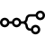
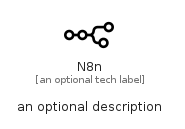

# N8N


```text
simpleicons/N/N8N
```

```text
include('simpleicons/N/N8N')
```


| Illustration | N8N |
| :---: | :---: |
|  |  |


## Sprites
The item provides the following sriptes:

- `<$N8NXs>`
- `<$N8NSm>`
- `<$N8NMd>`
- `<$N8NLg>`


## N8N

### Load remotely
```plantuml
@startuml
' configures the library
!global $LIB_BASE_LOCATION="https://raw.githubusercontent.com/tmorin/plantuml-libs/master/distribution"

' loads the library's bootstrap
!include $LIB_BASE_LOCATION/bootstrap.puml

' loads the package bootstrap
include('simpleicons/bootstrap')

' loads the Item which embeds the element N8N
include('simpleicons/N/N8N')

' renders the element
N8N('N8n', 'N8n', 'an optional tech label', 'an optional description')
@enduml
```

### Load locally
```plantuml
@startuml
' configures the library
!global $INCLUSION_MODE="local"
!global $LIB_BASE_LOCATION="../.."

' loads the library's bootstrap
!include $LIB_BASE_LOCATION/bootstrap.puml

' loads the package bootstrap
include('simpleicons/bootstrap')

' loads the Item which embeds the element N8N
include('simpleicons/N/N8N')

' renders the element
N8N('N8n', 'N8n', 'an optional tech label', 'an optional description')
@enduml
```

