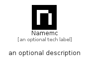

# Namemc


```text
simpleicons/N/Namemc
```

```text
include('simpleicons/N/Namemc')
```


| Illustration | Namemc |
| :---: | :---: |
|  |  |


## Sprites
The item provides the following sriptes:

- `<$NamemcXs>`
- `<$NamemcSm>`
- `<$NamemcMd>`
- `<$NamemcLg>`


## Namemc

### Load remotely
```plantuml
@startuml
' configures the library
!global $LIB_BASE_LOCATION="https://raw.githubusercontent.com/tmorin/plantuml-libs/master/distribution"

' loads the library's bootstrap
!include $LIB_BASE_LOCATION/bootstrap.puml

' loads the package bootstrap
include('simpleicons/bootstrap')

' loads the Item which embeds the element Namemc
include('simpleicons/N/Namemc')

' renders the element
Namemc('Namemc', 'Namemc', 'an optional tech label', 'an optional description')
@enduml
```

### Load locally
```plantuml
@startuml
' configures the library
!global $INCLUSION_MODE="local"
!global $LIB_BASE_LOCATION="../.."

' loads the library's bootstrap
!include $LIB_BASE_LOCATION/bootstrap.puml

' loads the package bootstrap
include('simpleicons/bootstrap')

' loads the Item which embeds the element Namemc
include('simpleicons/N/Namemc')

' renders the element
Namemc('Namemc', 'Namemc', 'an optional tech label', 'an optional description')
@enduml
```

