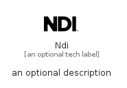

# Ndi


```text
simpleicons/N/Ndi
```

```text
include('simpleicons/N/Ndi')
```


| Illustration | Ndi |
| :---: | :---: |
|  |  |


## Sprites
The item provides the following sriptes:

- `<$NdiXs>`
- `<$NdiSm>`
- `<$NdiMd>`
- `<$NdiLg>`


## Ndi

### Load remotely
```plantuml
@startuml
' configures the library
!global $LIB_BASE_LOCATION="https://raw.githubusercontent.com/tmorin/plantuml-libs/master/distribution"

' loads the library's bootstrap
!include $LIB_BASE_LOCATION/bootstrap.puml

' loads the package bootstrap
include('simpleicons/bootstrap')

' loads the Item which embeds the element Ndi
include('simpleicons/N/Ndi')

' renders the element
Ndi('Ndi', 'Ndi', 'an optional tech label', 'an optional description')
@enduml
```

### Load locally
```plantuml
@startuml
' configures the library
!global $INCLUSION_MODE="local"
!global $LIB_BASE_LOCATION="../.."

' loads the library's bootstrap
!include $LIB_BASE_LOCATION/bootstrap.puml

' loads the package bootstrap
include('simpleicons/bootstrap')

' loads the Item which embeds the element Ndi
include('simpleicons/N/Ndi')

' renders the element
Ndi('Ndi', 'Ndi', 'an optional tech label', 'an optional description')
@enduml
```

