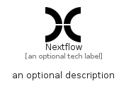

# Nextflow


```text
simpleicons/N/Nextflow
```

```text
include('simpleicons/N/Nextflow')
```


| Illustration | Nextflow |
| :---: | :---: |
|  |  |


## Sprites
The item provides the following sriptes:

- `<$NextflowXs>`
- `<$NextflowSm>`
- `<$NextflowMd>`
- `<$NextflowLg>`


## Nextflow

### Load remotely
```plantuml
@startuml
' configures the library
!global $LIB_BASE_LOCATION="https://raw.githubusercontent.com/tmorin/plantuml-libs/master/distribution"

' loads the library's bootstrap
!include $LIB_BASE_LOCATION/bootstrap.puml

' loads the package bootstrap
include('simpleicons/bootstrap')

' loads the Item which embeds the element Nextflow
include('simpleicons/N/Nextflow')

' renders the element
Nextflow('Nextflow', 'Nextflow', 'an optional tech label', 'an optional description')
@enduml
```

### Load locally
```plantuml
@startuml
' configures the library
!global $INCLUSION_MODE="local"
!global $LIB_BASE_LOCATION="../.."

' loads the library's bootstrap
!include $LIB_BASE_LOCATION/bootstrap.puml

' loads the package bootstrap
include('simpleicons/bootstrap')

' loads the Item which embeds the element Nextflow
include('simpleicons/N/Nextflow')

' renders the element
Nextflow('Nextflow', 'Nextflow', 'an optional tech label', 'an optional description')
@enduml
```

