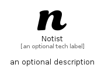

# Notist


```text
simpleicons/N/Notist
```

```text
include('simpleicons/N/Notist')
```


| Illustration | Notist |
| :---: | :---: |
|  |  |


## Sprites
The item provides the following sriptes:

- `<$NotistXs>`
- `<$NotistSm>`
- `<$NotistMd>`
- `<$NotistLg>`


## Notist

### Load remotely
```plantuml
@startuml
' configures the library
!global $LIB_BASE_LOCATION="https://raw.githubusercontent.com/tmorin/plantuml-libs/master/distribution"

' loads the library's bootstrap
!include $LIB_BASE_LOCATION/bootstrap.puml

' loads the package bootstrap
include('simpleicons/bootstrap')

' loads the Item which embeds the element Notist
include('simpleicons/N/Notist')

' renders the element
Notist('Notist', 'Notist', 'an optional tech label', 'an optional description')
@enduml
```

### Load locally
```plantuml
@startuml
' configures the library
!global $INCLUSION_MODE="local"
!global $LIB_BASE_LOCATION="../.."

' loads the library's bootstrap
!include $LIB_BASE_LOCATION/bootstrap.puml

' loads the package bootstrap
include('simpleicons/bootstrap')

' loads the Item which embeds the element Notist
include('simpleicons/N/Notist')

' renders the element
Notist('Notist', 'Notist', 'an optional tech label', 'an optional description')
@enduml
```

