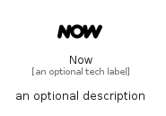

# Now


```text
simpleicons/N/Now
```

```text
include('simpleicons/N/Now')
```


| Illustration | Now |
| :---: | :---: |
|  |  |


## Sprites
The item provides the following sriptes:

- `<$NowXs>`
- `<$NowSm>`
- `<$NowMd>`
- `<$NowLg>`


## Now

### Load remotely
```plantuml
@startuml
' configures the library
!global $LIB_BASE_LOCATION="https://raw.githubusercontent.com/tmorin/plantuml-libs/master/distribution"

' loads the library's bootstrap
!include $LIB_BASE_LOCATION/bootstrap.puml

' loads the package bootstrap
include('simpleicons/bootstrap')

' loads the Item which embeds the element Now
include('simpleicons/N/Now')

' renders the element
Now('Now', 'Now', 'an optional tech label', 'an optional description')
@enduml
```

### Load locally
```plantuml
@startuml
' configures the library
!global $INCLUSION_MODE="local"
!global $LIB_BASE_LOCATION="../.."

' loads the library's bootstrap
!include $LIB_BASE_LOCATION/bootstrap.puml

' loads the package bootstrap
include('simpleicons/bootstrap')

' loads the Item which embeds the element Now
include('simpleicons/N/Now')

' renders the element
Now('Now', 'Now', 'an optional tech label', 'an optional description')
@enduml
```

