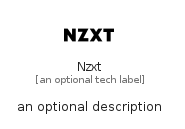

# Nzxt


```text
simpleicons/N/Nzxt
```

```text
include('simpleicons/N/Nzxt')
```


| Illustration | Nzxt |
| :---: | :---: |
|  |  |


## Sprites
The item provides the following sriptes:

- `<$NzxtXs>`
- `<$NzxtSm>`
- `<$NzxtMd>`
- `<$NzxtLg>`


## Nzxt

### Load remotely
```plantuml
@startuml
' configures the library
!global $LIB_BASE_LOCATION="https://raw.githubusercontent.com/tmorin/plantuml-libs/master/distribution"

' loads the library's bootstrap
!include $LIB_BASE_LOCATION/bootstrap.puml

' loads the package bootstrap
include('simpleicons/bootstrap')

' loads the Item which embeds the element Nzxt
include('simpleicons/N/Nzxt')

' renders the element
Nzxt('Nzxt', 'Nzxt', 'an optional tech label', 'an optional description')
@enduml
```

### Load locally
```plantuml
@startuml
' configures the library
!global $INCLUSION_MODE="local"
!global $LIB_BASE_LOCATION="../.."

' loads the library's bootstrap
!include $LIB_BASE_LOCATION/bootstrap.puml

' loads the package bootstrap
include('simpleicons/bootstrap')

' loads the Item which embeds the element Nzxt
include('simpleicons/N/Nzxt')

' renders the element
Nzxt('Nzxt', 'Nzxt', 'an optional tech label', 'an optional description')
@enduml
```

