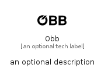

# Obb


```text
simpleicons/O/Obb
```

```text
include('simpleicons/O/Obb')
```


| Illustration | Obb |
| :---: | :---: |
|  |  |


## Sprites
The item provides the following sriptes:

- `<$ObbXs>`
- `<$ObbSm>`
- `<$ObbMd>`
- `<$ObbLg>`


## Obb

### Load remotely
```plantuml
@startuml
' configures the library
!global $LIB_BASE_LOCATION="https://raw.githubusercontent.com/tmorin/plantuml-libs/master/distribution"

' loads the library's bootstrap
!include $LIB_BASE_LOCATION/bootstrap.puml

' loads the package bootstrap
include('simpleicons/bootstrap')

' loads the Item which embeds the element Obb
include('simpleicons/O/Obb')

' renders the element
Obb('Obb', 'Obb', 'an optional tech label', 'an optional description')
@enduml
```

### Load locally
```plantuml
@startuml
' configures the library
!global $INCLUSION_MODE="local"
!global $LIB_BASE_LOCATION="../.."

' loads the library's bootstrap
!include $LIB_BASE_LOCATION/bootstrap.puml

' loads the package bootstrap
include('simpleicons/bootstrap')

' loads the Item which embeds the element Obb
include('simpleicons/O/Obb')

' renders the element
Obb('Obb', 'Obb', 'an optional tech label', 'an optional description')
@enduml
```

