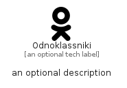

# Odnoklassniki


```text
simpleicons/O/Odnoklassniki
```

```text
include('simpleicons/O/Odnoklassniki')
```


| Illustration | Odnoklassniki |
| :---: | :---: |
|  |  |


## Sprites
The item provides the following sriptes:

- `<$OdnoklassnikiXs>`
- `<$OdnoklassnikiSm>`
- `<$OdnoklassnikiMd>`
- `<$OdnoklassnikiLg>`


## Odnoklassniki

### Load remotely
```plantuml
@startuml
' configures the library
!global $LIB_BASE_LOCATION="https://raw.githubusercontent.com/tmorin/plantuml-libs/master/distribution"

' loads the library's bootstrap
!include $LIB_BASE_LOCATION/bootstrap.puml

' loads the package bootstrap
include('simpleicons/bootstrap')

' loads the Item which embeds the element Odnoklassniki
include('simpleicons/O/Odnoklassniki')

' renders the element
Odnoklassniki('Odnoklassniki', 'Odnoklassniki', 'an optional tech label', 'an optional description')
@enduml
```

### Load locally
```plantuml
@startuml
' configures the library
!global $INCLUSION_MODE="local"
!global $LIB_BASE_LOCATION="../.."

' loads the library's bootstrap
!include $LIB_BASE_LOCATION/bootstrap.puml

' loads the package bootstrap
include('simpleicons/bootstrap')

' loads the Item which embeds the element Odnoklassniki
include('simpleicons/O/Odnoklassniki')

' renders the element
Odnoklassniki('Odnoklassniki', 'Odnoklassniki', 'an optional tech label', 'an optional description')
@enduml
```

