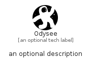

# Odysee


```text
simpleicons/O/Odysee
```

```text
include('simpleicons/O/Odysee')
```


| Illustration | Odysee |
| :---: | :---: |
|  |  |


## Sprites
The item provides the following sriptes:

- `<$OdyseeXs>`
- `<$OdyseeSm>`
- `<$OdyseeMd>`
- `<$OdyseeLg>`


## Odysee

### Load remotely
```plantuml
@startuml
' configures the library
!global $LIB_BASE_LOCATION="https://raw.githubusercontent.com/tmorin/plantuml-libs/master/distribution"

' loads the library's bootstrap
!include $LIB_BASE_LOCATION/bootstrap.puml

' loads the package bootstrap
include('simpleicons/bootstrap')

' loads the Item which embeds the element Odysee
include('simpleicons/O/Odysee')

' renders the element
Odysee('Odysee', 'Odysee', 'an optional tech label', 'an optional description')
@enduml
```

### Load locally
```plantuml
@startuml
' configures the library
!global $INCLUSION_MODE="local"
!global $LIB_BASE_LOCATION="../.."

' loads the library's bootstrap
!include $LIB_BASE_LOCATION/bootstrap.puml

' loads the package bootstrap
include('simpleicons/bootstrap')

' loads the Item which embeds the element Odysee
include('simpleicons/O/Odysee')

' renders the element
Odysee('Odysee', 'Odysee', 'an optional tech label', 'an optional description')
@enduml
```

