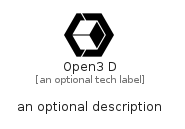

# Open3D


```text
simpleicons/O/Open3D
```

```text
include('simpleicons/O/Open3D')
```


| Illustration | Open3D |
| :---: | :---: |
|  |  |


## Sprites
The item provides the following sriptes:

- `<$Open3DXs>`
- `<$Open3DSm>`
- `<$Open3DMd>`
- `<$Open3DLg>`


## Open3D

### Load remotely
```plantuml
@startuml
' configures the library
!global $LIB_BASE_LOCATION="https://raw.githubusercontent.com/tmorin/plantuml-libs/master/distribution"

' loads the library's bootstrap
!include $LIB_BASE_LOCATION/bootstrap.puml

' loads the package bootstrap
include('simpleicons/bootstrap')

' loads the Item which embeds the element Open3D
include('simpleicons/O/Open3D')

' renders the element
Open3D('Open3D', 'Open3 D', 'an optional tech label', 'an optional description')
@enduml
```

### Load locally
```plantuml
@startuml
' configures the library
!global $INCLUSION_MODE="local"
!global $LIB_BASE_LOCATION="../.."

' loads the library's bootstrap
!include $LIB_BASE_LOCATION/bootstrap.puml

' loads the package bootstrap
include('simpleicons/bootstrap')

' loads the Item which embeds the element Open3D
include('simpleicons/O/Open3D')

' renders the element
Open3D('Open3D', 'Open3 D', 'an optional tech label', 'an optional description')
@enduml
```

