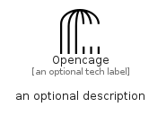

# Opencage


```text
simpleicons/O/Opencage
```

```text
include('simpleicons/O/Opencage')
```


| Illustration | Opencage |
| :---: | :---: |
|  |  |


## Sprites
The item provides the following sriptes:

- `<$OpencageXs>`
- `<$OpencageSm>`
- `<$OpencageMd>`
- `<$OpencageLg>`


## Opencage

### Load remotely
```plantuml
@startuml
' configures the library
!global $LIB_BASE_LOCATION="https://raw.githubusercontent.com/tmorin/plantuml-libs/master/distribution"

' loads the library's bootstrap
!include $LIB_BASE_LOCATION/bootstrap.puml

' loads the package bootstrap
include('simpleicons/bootstrap')

' loads the Item which embeds the element Opencage
include('simpleicons/O/Opencage')

' renders the element
Opencage('Opencage', 'Opencage', 'an optional tech label', 'an optional description')
@enduml
```

### Load locally
```plantuml
@startuml
' configures the library
!global $INCLUSION_MODE="local"
!global $LIB_BASE_LOCATION="../.."

' loads the library's bootstrap
!include $LIB_BASE_LOCATION/bootstrap.puml

' loads the package bootstrap
include('simpleicons/bootstrap')

' loads the Item which embeds the element Opencage
include('simpleicons/O/Opencage')

' renders the element
Opencage('Opencage', 'Opencage', 'an optional tech label', 'an optional description')
@enduml
```

