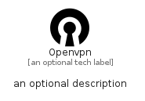

# Openvpn


```text
simpleicons/O/Openvpn
```

```text
include('simpleicons/O/Openvpn')
```


| Illustration | Openvpn |
| :---: | :---: |
|  |  |


## Sprites
The item provides the following sriptes:

- `<$OpenvpnXs>`
- `<$OpenvpnSm>`
- `<$OpenvpnMd>`
- `<$OpenvpnLg>`


## Openvpn

### Load remotely
```plantuml
@startuml
' configures the library
!global $LIB_BASE_LOCATION="https://raw.githubusercontent.com/tmorin/plantuml-libs/master/distribution"

' loads the library's bootstrap
!include $LIB_BASE_LOCATION/bootstrap.puml

' loads the package bootstrap
include('simpleicons/bootstrap')

' loads the Item which embeds the element Openvpn
include('simpleicons/O/Openvpn')

' renders the element
Openvpn('Openvpn', 'Openvpn', 'an optional tech label', 'an optional description')
@enduml
```

### Load locally
```plantuml
@startuml
' configures the library
!global $INCLUSION_MODE="local"
!global $LIB_BASE_LOCATION="../.."

' loads the library's bootstrap
!include $LIB_BASE_LOCATION/bootstrap.puml

' loads the package bootstrap
include('simpleicons/bootstrap')

' loads the Item which embeds the element Openvpn
include('simpleicons/O/Openvpn')

' renders the element
Openvpn('Openvpn', 'Openvpn', 'an optional tech label', 'an optional description')
@enduml
```

