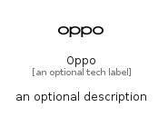

# Oppo


```text
simpleicons/O/Oppo
```

```text
include('simpleicons/O/Oppo')
```


| Illustration | Oppo |
| :---: | :---: |
|  |  |


## Sprites
The item provides the following sriptes:

- `<$OppoXs>`
- `<$OppoSm>`
- `<$OppoMd>`
- `<$OppoLg>`


## Oppo

### Load remotely
```plantuml
@startuml
' configures the library
!global $LIB_BASE_LOCATION="https://raw.githubusercontent.com/tmorin/plantuml-libs/master/distribution"

' loads the library's bootstrap
!include $LIB_BASE_LOCATION/bootstrap.puml

' loads the package bootstrap
include('simpleicons/bootstrap')

' loads the Item which embeds the element Oppo
include('simpleicons/O/Oppo')

' renders the element
Oppo('Oppo', 'Oppo', 'an optional tech label', 'an optional description')
@enduml
```

### Load locally
```plantuml
@startuml
' configures the library
!global $INCLUSION_MODE="local"
!global $LIB_BASE_LOCATION="../.."

' loads the library's bootstrap
!include $LIB_BASE_LOCATION/bootstrap.puml

' loads the package bootstrap
include('simpleicons/bootstrap')

' loads the Item which embeds the element Oppo
include('simpleicons/O/Oppo')

' renders the element
Oppo('Oppo', 'Oppo', 'an optional tech label', 'an optional description')
@enduml
```

