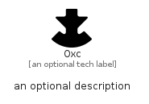

# Oxc


```text
simpleicons/O/Oxc
```

```text
include('simpleicons/O/Oxc')
```


| Illustration | Oxc |
| :---: | :---: |
|  |  |


## Sprites
The item provides the following sriptes:

- `<$OxcXs>`
- `<$OxcSm>`
- `<$OxcMd>`
- `<$OxcLg>`


## Oxc

### Load remotely
```plantuml
@startuml
' configures the library
!global $LIB_BASE_LOCATION="https://raw.githubusercontent.com/tmorin/plantuml-libs/master/distribution"

' loads the library's bootstrap
!include $LIB_BASE_LOCATION/bootstrap.puml

' loads the package bootstrap
include('simpleicons/bootstrap')

' loads the Item which embeds the element Oxc
include('simpleicons/O/Oxc')

' renders the element
Oxc('Oxc', 'Oxc', 'an optional tech label', 'an optional description')
@enduml
```

### Load locally
```plantuml
@startuml
' configures the library
!global $INCLUSION_MODE="local"
!global $LIB_BASE_LOCATION="../.."

' loads the library's bootstrap
!include $LIB_BASE_LOCATION/bootstrap.puml

' loads the package bootstrap
include('simpleicons/bootstrap')

' loads the Item which embeds the element Oxc
include('simpleicons/O/Oxc')

' renders the element
Oxc('Oxc', 'Oxc', 'an optional tech label', 'an optional description')
@enduml
```

