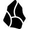
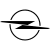

# O

The module contains 108 items.

| |Name|
|:---:|---|
|  | [simpleicons/O/O2](../../simpleicons/O/O2.md) |
|  | [simpleicons/O/Obb](../../simpleicons/O/Obb.md) |
|  | [simpleicons/O/Observable](../../simpleicons/O/Observable.md) |
|  | [simpleicons/O/Obsidian](../../simpleicons/O/Obsidian.md) |
|  | [simpleicons/O/Obsstudio](../../simpleicons/O/Obsstudio.md) |
|  | [simpleicons/O/Obtainium](../../simpleicons/O/Obtainium.md) |
|  | [simpleicons/O/Ocaml](../../simpleicons/O/Ocaml.md) |
|  | [simpleicons/O/Oclc](../../simpleicons/O/Oclc.md) |
|  | [simpleicons/O/Oclif](../../simpleicons/O/Oclif.md) |
|  | [simpleicons/O/Octanerender](../../simpleicons/O/Octanerender.md) |
|  | [simpleicons/O/Octave](../../simpleicons/O/Octave.md) |
|  | [simpleicons/O/Octobercms](../../simpleicons/O/Octobercms.md) |
|  | [simpleicons/O/Octoprint](../../simpleicons/O/Octoprint.md) |
|  | [simpleicons/O/Octopusdeploy](../../simpleicons/O/Octopusdeploy.md) |
|  | [simpleicons/O/Oculus](../../simpleicons/O/Oculus.md) |
|  | [simpleicons/O/Odido](../../simpleicons/O/Odido.md) |
|  | [simpleicons/O/Odin](../../simpleicons/O/Odin.md) |
|  | [simpleicons/O/Odnoklassniki](../../simpleicons/O/Odnoklassniki.md) |
|  | [simpleicons/O/Odoo](../../simpleicons/O/Odoo.md) |
|  | [simpleicons/O/Odysee](../../simpleicons/O/Odysee.md) |
|  | [simpleicons/O/Ohdear](../../simpleicons/O/Ohdear.md) |
|  | [simpleicons/O/Okcupid](../../simpleicons/O/Okcupid.md) |
|  | [simpleicons/O/Okta](../../simpleicons/O/Okta.md) |
|  | [simpleicons/O/Okx](../../simpleicons/O/Okx.md) |
|  | [simpleicons/O/Ollama](../../simpleicons/O/Ollama.md) |
|  | [simpleicons/O/Omadacloud](../../simpleicons/O/Omadacloud.md) |
|  | [simpleicons/O/Omarchy](../../simpleicons/O/Omarchy.md) |
|  | [simpleicons/O/Oneplus](../../simpleicons/O/Oneplus.md) |
|  | [simpleicons/O/Onestream](../../simpleicons/O/Onestream.md) |
|  | [simpleicons/O/Onlyfans](../../simpleicons/O/Onlyfans.md) |
|  | [simpleicons/O/Onlyoffice](../../simpleicons/O/Onlyoffice.md) |
|  | [simpleicons/O/Onnx](../../simpleicons/O/Onnx.md) |
|  | [simpleicons/O/Onstar](../../simpleicons/O/Onstar.md) |
|  | [simpleicons/O/Opel](../../simpleicons/O/Opel.md) |
|  | [simpleicons/O/Open3D](../../simpleicons/O/Open3D.md) |
|  | [simpleicons/O/Openaccess](../../simpleicons/O/Openaccess.md) |
|  | [simpleicons/O/Openaigym](../../simpleicons/O/Openaigym.md) |
|  | [simpleicons/O/Openapiinitiative](../../simpleicons/O/Openapiinitiative.md) |
|  | [simpleicons/O/Openbadges](../../simpleicons/O/Openbadges.md) |
|  | [simpleicons/O/Openbsd](../../simpleicons/O/Openbsd.md) |
|  | [simpleicons/O/Openbugbounty](../../simpleicons/O/Openbugbounty.md) |
|  | [simpleicons/O/Opencage](../../simpleicons/O/Opencage.md) |
|  | [simpleicons/O/Opencollective](../../simpleicons/O/Opencollective.md) |
|  | [simpleicons/O/Opencontainersinitiative](../../simpleicons/O/Opencontainersinitiative.md) |
|  | [simpleicons/O/Opencritic](../../simpleicons/O/Opencritic.md) |
|  | [simpleicons/O/Opencv](../../simpleicons/O/Opencv.md) |
|  | [simpleicons/O/Openfaas](../../simpleicons/O/Openfaas.md) |
|  | [simpleicons/O/Opengl](../../simpleicons/O/Opengl.md) |
|  | [simpleicons/O/Openhab](../../simpleicons/O/Openhab.md) |
|  | [simpleicons/O/Openid](../../simpleicons/O/Openid.md) |
|  | [simpleicons/O/Openjdk](../../simpleicons/O/Openjdk.md) |
|  | [simpleicons/O/Openjsfoundation](../../simpleicons/O/Openjsfoundation.md) |
|  | [simpleicons/O/Openlayers](../../simpleicons/O/Openlayers.md) |
|  | [simpleicons/O/Openmediavault](../../simpleicons/O/Openmediavault.md) |
|  | [simpleicons/O/Openmined](../../simpleicons/O/Openmined.md) |
|  | [simpleicons/O/Opennebula](../../simpleicons/O/Opennebula.md) |
|  | [simpleicons/O/Openproject](../../simpleicons/O/Openproject.md) |
|  | [simpleicons/O/Openrouter](../../simpleicons/O/Openrouter.md) |
|  | [simpleicons/O/Openscad](../../simpleicons/O/Openscad.md) |
|  | [simpleicons/O/Opensea](../../simpleicons/O/Opensea.md) |
|  | [simpleicons/O/Opensearch](../../simpleicons/O/Opensearch.md) |
|  | [simpleicons/O/Opensourcehardware](../../simpleicons/O/Opensourcehardware.md) |
|  | [simpleicons/O/Opensourceinitiative](../../simpleicons/O/Opensourceinitiative.md) |
|  | [simpleicons/O/Openssl](../../simpleicons/O/Openssl.md) |
|  | [simpleicons/O/Openstack](../../simpleicons/O/Openstack.md) |
|  | [simpleicons/O/Openstreetmap](../../simpleicons/O/Openstreetmap.md) |
|  | [simpleicons/O/Opensuse](../../simpleicons/O/Opensuse.md) |
|  | [simpleicons/O/Opentelemetry](../../simpleicons/O/Opentelemetry.md) |
|  | [simpleicons/O/Opentext](../../simpleicons/O/Opentext.md) |
|  | [simpleicons/O/Opentofu](../../simpleicons/O/Opentofu.md) |
|  | [simpleicons/O/Openverse](../../simpleicons/O/Openverse.md) |
|  | [simpleicons/O/Openvpn](../../simpleicons/O/Openvpn.md) |
|  | [simpleicons/O/Openwrt](../../simpleicons/O/Openwrt.md) |
|  | [simpleicons/O/Openzeppelin](../../simpleicons/O/Openzeppelin.md) |
|  | [simpleicons/O/Openzfs](../../simpleicons/O/Openzfs.md) |
|  | [simpleicons/O/Opera](../../simpleicons/O/Opera.md) |
|  | [simpleicons/O/Operagx](../../simpleicons/O/Operagx.md) |
|  | [simpleicons/O/Opnsense](../../simpleicons/O/Opnsense.md) |
|  | [simpleicons/O/Oppo](../../simpleicons/O/Oppo.md) |
|  | [simpleicons/O/Opsgenie](../../simpleicons/O/Opsgenie.md) |
|  | [simpleicons/O/Opslevel](../../simpleicons/O/Opslevel.md) |
|  | [simpleicons/O/Optimism](../../simpleicons/O/Optimism.md) |
|  | [simpleicons/O/Optuna](../../simpleicons/O/Optuna.md) |
|  | [simpleicons/O/Orange](../../simpleicons/O/Orange.md) |
|  | [simpleicons/O/Orchardcore](../../simpleicons/O/Orchardcore.md) |
|  | [simpleicons/O/Orcid](../../simpleicons/O/Orcid.md) |
|  | [simpleicons/O/Oreilly](../../simpleicons/O/Oreilly.md) |
|  | [simpleicons/O/Org](../../simpleicons/O/Org.md) |
|  | [simpleicons/O/Organicmaps](../../simpleicons/O/Organicmaps.md) |
|  | [simpleicons/O/Origin](../../simpleicons/O/Origin.md) |
|  | [simpleicons/O/Ory](../../simpleicons/O/Ory.md) |
|  | [simpleicons/O/Osano](../../simpleicons/O/Osano.md) |
|  | [simpleicons/O/Osf](../../simpleicons/O/Osf.md) |
|  | [simpleicons/O/Osgeo](../../simpleicons/O/Osgeo.md) |
|  | [simpleicons/O/Oshkosh](../../simpleicons/O/Oshkosh.md) |
|  | [simpleicons/O/Osmand](../../simpleicons/O/Osmand.md) |
|  | [simpleicons/O/Osmc](../../simpleicons/O/Osmc.md) |
|  | [simpleicons/O/Osu](../../simpleicons/O/Osu.md) |
|  | [simpleicons/O/Otto](../../simpleicons/O/Otto.md) |
|  | [simpleicons/O/Outline](../../simpleicons/O/Outline.md) |
|  | [simpleicons/O/Overcast](../../simpleicons/O/Overcast.md) |
|  | [simpleicons/O/Overleaf](../../simpleicons/O/Overleaf.md) |
|  | [simpleicons/O/Ovh](../../simpleicons/O/Ovh.md) |
|  | [simpleicons/O/Owasp](../../simpleicons/O/Owasp.md) |
|  | [simpleicons/O/Owncloud](../../simpleicons/O/Owncloud.md) |
|  | [simpleicons/O/Oxc](../../simpleicons/O/Oxc.md) |
|  | [simpleicons/O/Oxygen](../../simpleicons/O/Oxygen.md) |
|  | [simpleicons/O/Oyo](../../simpleicons/O/Oyo.md) |

