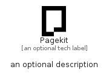

# Pagekit


```text
simpleicons/P/Pagekit
```

```text
include('simpleicons/P/Pagekit')
```


| Illustration | Pagekit |
| :---: | :---: |
|  |  |


## Sprites
The item provides the following sriptes:

- `<$PagekitXs>`
- `<$PagekitSm>`
- `<$PagekitMd>`
- `<$PagekitLg>`


## Pagekit

### Load remotely
```plantuml
@startuml
' configures the library
!global $LIB_BASE_LOCATION="https://raw.githubusercontent.com/tmorin/plantuml-libs/master/distribution"

' loads the library's bootstrap
!include $LIB_BASE_LOCATION/bootstrap.puml

' loads the package bootstrap
include('simpleicons/bootstrap')

' loads the Item which embeds the element Pagekit
include('simpleicons/P/Pagekit')

' renders the element
Pagekit('Pagekit', 'Pagekit', 'an optional tech label', 'an optional description')
@enduml
```

### Load locally
```plantuml
@startuml
' configures the library
!global $INCLUSION_MODE="local"
!global $LIB_BASE_LOCATION="../.."

' loads the library's bootstrap
!include $LIB_BASE_LOCATION/bootstrap.puml

' loads the package bootstrap
include('simpleicons/bootstrap')

' loads the Item which embeds the element Pagekit
include('simpleicons/P/Pagekit')

' renders the element
Pagekit('Pagekit', 'Pagekit', 'an optional tech label', 'an optional description')
@enduml
```

