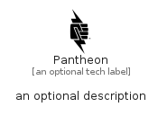

# Pantheon


```text
simpleicons/P/Pantheon
```

```text
include('simpleicons/P/Pantheon')
```


| Illustration | Pantheon |
| :---: | :---: |
|  |  |


## Sprites
The item provides the following sriptes:

- `<$PantheonXs>`
- `<$PantheonSm>`
- `<$PantheonMd>`
- `<$PantheonLg>`


## Pantheon

### Load remotely
```plantuml
@startuml
' configures the library
!global $LIB_BASE_LOCATION="https://raw.githubusercontent.com/tmorin/plantuml-libs/master/distribution"

' loads the library's bootstrap
!include $LIB_BASE_LOCATION/bootstrap.puml

' loads the package bootstrap
include('simpleicons/bootstrap')

' loads the Item which embeds the element Pantheon
include('simpleicons/P/Pantheon')

' renders the element
Pantheon('Pantheon', 'Pantheon', 'an optional tech label', 'an optional description')
@enduml
```

### Load locally
```plantuml
@startuml
' configures the library
!global $INCLUSION_MODE="local"
!global $LIB_BASE_LOCATION="../.."

' loads the library's bootstrap
!include $LIB_BASE_LOCATION/bootstrap.puml

' loads the package bootstrap
include('simpleicons/bootstrap')

' loads the Item which embeds the element Pantheon
include('simpleicons/P/Pantheon')

' renders the element
Pantheon('Pantheon', 'Pantheon', 'an optional tech label', 'an optional description')
@enduml
```

