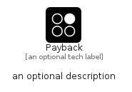

# Payback


```text
simpleicons/P/Payback
```

```text
include('simpleicons/P/Payback')
```


| Illustration | Payback |
| :---: | :---: |
|  |  |


## Sprites
The item provides the following sriptes:

- `<$PaybackXs>`
- `<$PaybackSm>`
- `<$PaybackMd>`
- `<$PaybackLg>`


## Payback

### Load remotely
```plantuml
@startuml
' configures the library
!global $LIB_BASE_LOCATION="https://raw.githubusercontent.com/tmorin/plantuml-libs/master/distribution"

' loads the library's bootstrap
!include $LIB_BASE_LOCATION/bootstrap.puml

' loads the package bootstrap
include('simpleicons/bootstrap')

' loads the Item which embeds the element Payback
include('simpleicons/P/Payback')

' renders the element
Payback('Payback', 'Payback', 'an optional tech label', 'an optional description')
@enduml
```

### Load locally
```plantuml
@startuml
' configures the library
!global $INCLUSION_MODE="local"
!global $LIB_BASE_LOCATION="../.."

' loads the library's bootstrap
!include $LIB_BASE_LOCATION/bootstrap.puml

' loads the package bootstrap
include('simpleicons/bootstrap')

' loads the Item which embeds the element Payback
include('simpleicons/P/Payback')

' renders the element
Payback('Payback', 'Payback', 'an optional tech label', 'an optional description')
@enduml
```

