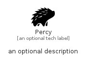

# Percy


```text
simpleicons/P/Percy
```

```text
include('simpleicons/P/Percy')
```


| Illustration | Percy |
| :---: | :---: |
|  |  |


## Sprites
The item provides the following sriptes:

- `<$PercyXs>`
- `<$PercySm>`
- `<$PercyMd>`
- `<$PercyLg>`


## Percy

### Load remotely
```plantuml
@startuml
' configures the library
!global $LIB_BASE_LOCATION="https://raw.githubusercontent.com/tmorin/plantuml-libs/master/distribution"

' loads the library's bootstrap
!include $LIB_BASE_LOCATION/bootstrap.puml

' loads the package bootstrap
include('simpleicons/bootstrap')

' loads the Item which embeds the element Percy
include('simpleicons/P/Percy')

' renders the element
Percy('Percy', 'Percy', 'an optional tech label', 'an optional description')
@enduml
```

### Load locally
```plantuml
@startuml
' configures the library
!global $INCLUSION_MODE="local"
!global $LIB_BASE_LOCATION="../.."

' loads the library's bootstrap
!include $LIB_BASE_LOCATION/bootstrap.puml

' loads the package bootstrap
include('simpleicons/bootstrap')

' loads the Item which embeds the element Percy
include('simpleicons/P/Percy')

' renders the element
Percy('Percy', 'Percy', 'an optional tech label', 'an optional description')
@enduml
```

