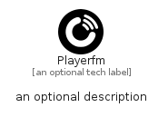

# Playerfm


```text
simpleicons/P/Playerfm
```

```text
include('simpleicons/P/Playerfm')
```


| Illustration | Playerfm |
| :---: | :---: |
|  |  |


## Sprites
The item provides the following sriptes:

- `<$PlayerfmXs>`
- `<$PlayerfmSm>`
- `<$PlayerfmMd>`
- `<$PlayerfmLg>`


## Playerfm

### Load remotely
```plantuml
@startuml
' configures the library
!global $LIB_BASE_LOCATION="https://raw.githubusercontent.com/tmorin/plantuml-libs/master/distribution"

' loads the library's bootstrap
!include $LIB_BASE_LOCATION/bootstrap.puml

' loads the package bootstrap
include('simpleicons/bootstrap')

' loads the Item which embeds the element Playerfm
include('simpleicons/P/Playerfm')

' renders the element
Playerfm('Playerfm', 'Playerfm', 'an optional tech label', 'an optional description')
@enduml
```

### Load locally
```plantuml
@startuml
' configures the library
!global $INCLUSION_MODE="local"
!global $LIB_BASE_LOCATION="../.."

' loads the library's bootstrap
!include $LIB_BASE_LOCATION/bootstrap.puml

' loads the package bootstrap
include('simpleicons/bootstrap')

' loads the Item which embeds the element Playerfm
include('simpleicons/P/Playerfm')

' renders the element
Playerfm('Playerfm', 'Playerfm', 'an optional tech label', 'an optional description')
@enduml
```

