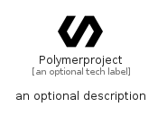

# Polymerproject


```text
simpleicons/P/Polymerproject
```

```text
include('simpleicons/P/Polymerproject')
```


| Illustration | Polymerproject |
| :---: | :---: |
|  |  |


## Sprites
The item provides the following sriptes:

- `<$PolymerprojectXs>`
- `<$PolymerprojectSm>`
- `<$PolymerprojectMd>`
- `<$PolymerprojectLg>`


## Polymerproject

### Load remotely
```plantuml
@startuml
' configures the library
!global $LIB_BASE_LOCATION="https://raw.githubusercontent.com/tmorin/plantuml-libs/master/distribution"

' loads the library's bootstrap
!include $LIB_BASE_LOCATION/bootstrap.puml

' loads the package bootstrap
include('simpleicons/bootstrap')

' loads the Item which embeds the element Polymerproject
include('simpleicons/P/Polymerproject')

' renders the element
Polymerproject('Polymerproject', 'Polymerproject', 'an optional tech label', 'an optional description')
@enduml
```

### Load locally
```plantuml
@startuml
' configures the library
!global $INCLUSION_MODE="local"
!global $LIB_BASE_LOCATION="../.."

' loads the library's bootstrap
!include $LIB_BASE_LOCATION/bootstrap.puml

' loads the package bootstrap
include('simpleicons/bootstrap')

' loads the Item which embeds the element Polymerproject
include('simpleicons/P/Polymerproject')

' renders the element
Polymerproject('Polymerproject', 'Polymerproject', 'an optional tech label', 'an optional description')
@enduml
```

