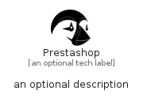

# Prestashop


```text
simpleicons/P/Prestashop
```

```text
include('simpleicons/P/Prestashop')
```


| Illustration | Prestashop |
| :---: | :---: |
|  |  |


## Sprites
The item provides the following sriptes:

- `<$PrestashopXs>`
- `<$PrestashopSm>`
- `<$PrestashopMd>`
- `<$PrestashopLg>`


## Prestashop

### Load remotely
```plantuml
@startuml
' configures the library
!global $LIB_BASE_LOCATION="https://raw.githubusercontent.com/tmorin/plantuml-libs/master/distribution"

' loads the library's bootstrap
!include $LIB_BASE_LOCATION/bootstrap.puml

' loads the package bootstrap
include('simpleicons/bootstrap')

' loads the Item which embeds the element Prestashop
include('simpleicons/P/Prestashop')

' renders the element
Prestashop('Prestashop', 'Prestashop', 'an optional tech label', 'an optional description')
@enduml
```

### Load locally
```plantuml
@startuml
' configures the library
!global $INCLUSION_MODE="local"
!global $LIB_BASE_LOCATION="../.."

' loads the library's bootstrap
!include $LIB_BASE_LOCATION/bootstrap.puml

' loads the package bootstrap
include('simpleicons/bootstrap')

' loads the Item which embeds the element Prestashop
include('simpleicons/P/Prestashop')

' renders the element
Prestashop('Prestashop', 'Prestashop', 'an optional tech label', 'an optional description')
@enduml
```

