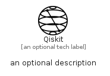

# Qiskit


```text
simpleicons/Q/Qiskit
```

```text
include('simpleicons/Q/Qiskit')
```


| Illustration | Qiskit |
| :---: | :---: |
|  |  |


## Sprites
The item provides the following sriptes:

- `<$QiskitXs>`
- `<$QiskitSm>`
- `<$QiskitMd>`
- `<$QiskitLg>`


## Qiskit

### Load remotely
```plantuml
@startuml
' configures the library
!global $LIB_BASE_LOCATION="https://raw.githubusercontent.com/tmorin/plantuml-libs/master/distribution"

' loads the library's bootstrap
!include $LIB_BASE_LOCATION/bootstrap.puml

' loads the package bootstrap
include('simpleicons/bootstrap')

' loads the Item which embeds the element Qiskit
include('simpleicons/Q/Qiskit')

' renders the element
Qiskit('Qiskit', 'Qiskit', 'an optional tech label', 'an optional description')
@enduml
```

### Load locally
```plantuml
@startuml
' configures the library
!global $INCLUSION_MODE="local"
!global $LIB_BASE_LOCATION="../.."

' loads the library's bootstrap
!include $LIB_BASE_LOCATION/bootstrap.puml

' loads the package bootstrap
include('simpleicons/bootstrap')

' loads the Item which embeds the element Qiskit
include('simpleicons/Q/Qiskit')

' renders the element
Qiskit('Qiskit', 'Qiskit', 'an optional tech label', 'an optional description')
@enduml
```

