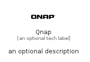

# Qnap


```text
simpleicons/Q/Qnap
```

```text
include('simpleicons/Q/Qnap')
```


| Illustration | Qnap |
| :---: | :---: |
|  |  |


## Sprites
The item provides the following sriptes:

- `<$QnapXs>`
- `<$QnapSm>`
- `<$QnapMd>`
- `<$QnapLg>`


## Qnap

### Load remotely
```plantuml
@startuml
' configures the library
!global $LIB_BASE_LOCATION="https://raw.githubusercontent.com/tmorin/plantuml-libs/master/distribution"

' loads the library's bootstrap
!include $LIB_BASE_LOCATION/bootstrap.puml

' loads the package bootstrap
include('simpleicons/bootstrap')

' loads the Item which embeds the element Qnap
include('simpleicons/Q/Qnap')

' renders the element
Qnap('Qnap', 'Qnap', 'an optional tech label', 'an optional description')
@enduml
```

### Load locally
```plantuml
@startuml
' configures the library
!global $INCLUSION_MODE="local"
!global $LIB_BASE_LOCATION="../.."

' loads the library's bootstrap
!include $LIB_BASE_LOCATION/bootstrap.puml

' loads the package bootstrap
include('simpleicons/bootstrap')

' loads the Item which embeds the element Qnap
include('simpleicons/Q/Qnap')

' renders the element
Qnap('Qnap', 'Qnap', 'an optional tech label', 'an optional description')
@enduml
```

