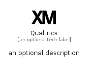

# Qualtrics


```text
simpleicons/Q/Qualtrics
```

```text
include('simpleicons/Q/Qualtrics')
```


| Illustration | Qualtrics |
| :---: | :---: |
|  |  |


## Sprites
The item provides the following sriptes:

- `<$QualtricsXs>`
- `<$QualtricsSm>`
- `<$QualtricsMd>`
- `<$QualtricsLg>`


## Qualtrics

### Load remotely
```plantuml
@startuml
' configures the library
!global $LIB_BASE_LOCATION="https://raw.githubusercontent.com/tmorin/plantuml-libs/master/distribution"

' loads the library's bootstrap
!include $LIB_BASE_LOCATION/bootstrap.puml

' loads the package bootstrap
include('simpleicons/bootstrap')

' loads the Item which embeds the element Qualtrics
include('simpleicons/Q/Qualtrics')

' renders the element
Qualtrics('Qualtrics', 'Qualtrics', 'an optional tech label', 'an optional description')
@enduml
```

### Load locally
```plantuml
@startuml
' configures the library
!global $INCLUSION_MODE="local"
!global $LIB_BASE_LOCATION="../.."

' loads the library's bootstrap
!include $LIB_BASE_LOCATION/bootstrap.puml

' loads the package bootstrap
include('simpleicons/bootstrap')

' loads the Item which embeds the element Qualtrics
include('simpleicons/Q/Qualtrics')

' renders the element
Qualtrics('Qualtrics', 'Qualtrics', 'an optional tech label', 'an optional description')
@enduml
```

