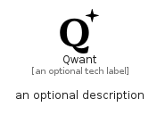

# Qwant


```text
simpleicons/Q/Qwant
```

```text
include('simpleicons/Q/Qwant')
```


| Illustration | Qwant |
| :---: | :---: |
|  |  |


## Sprites
The item provides the following sriptes:

- `<$QwantXs>`
- `<$QwantSm>`
- `<$QwantMd>`
- `<$QwantLg>`


## Qwant

### Load remotely
```plantuml
@startuml
' configures the library
!global $LIB_BASE_LOCATION="https://raw.githubusercontent.com/tmorin/plantuml-libs/master/distribution"

' loads the library's bootstrap
!include $LIB_BASE_LOCATION/bootstrap.puml

' loads the package bootstrap
include('simpleicons/bootstrap')

' loads the Item which embeds the element Qwant
include('simpleicons/Q/Qwant')

' renders the element
Qwant('Qwant', 'Qwant', 'an optional tech label', 'an optional description')
@enduml
```

### Load locally
```plantuml
@startuml
' configures the library
!global $INCLUSION_MODE="local"
!global $LIB_BASE_LOCATION="../.."

' loads the library's bootstrap
!include $LIB_BASE_LOCATION/bootstrap.puml

' loads the package bootstrap
include('simpleicons/bootstrap')

' loads the Item which embeds the element Qwant
include('simpleicons/Q/Qwant')

' renders the element
Qwant('Qwant', 'Qwant', 'an optional tech label', 'an optional description')
@enduml
```

