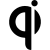

# Q

The module contains 38 items.

| |Name|
|:---:|---|
|  | [simpleicons/Q/Qantas](../../simpleicons/Q/Qantas.md) |
|  | [simpleicons/Q/Qase](../../simpleicons/Q/Qase.md) |
|  | [simpleicons/Q/Qatarairways](../../simpleicons/Q/Qatarairways.md) |
|  | [simpleicons/Q/Qbittorrent](../../simpleicons/Q/Qbittorrent.md) |
|  | [simpleicons/Q/Qemu](../../simpleicons/Q/Qemu.md) |
|  | [simpleicons/Q/Qgis](../../simpleicons/Q/Qgis.md) |
|  | [simpleicons/Q/Qi](../../simpleicons/Q/Qi.md) |
|  | [simpleicons/Q/Qiita](../../simpleicons/Q/Qiita.md) |
|  | [simpleicons/Q/Qiskit](../../simpleicons/Q/Qiskit.md) |
|  | [simpleicons/Q/Qiwi](../../simpleicons/Q/Qiwi.md) |
|  | [simpleicons/Q/Qlik](../../simpleicons/Q/Qlik.md) |
|  | [simpleicons/Q/Qlty](../../simpleicons/Q/Qlty.md) |
|  | [simpleicons/Q/Qmk](../../simpleicons/Q/Qmk.md) |
|  | [simpleicons/Q/Qnap](../../simpleicons/Q/Qnap.md) |
|  | [simpleicons/Q/Qodo](../../simpleicons/Q/Qodo.md) |
|  | [simpleicons/Q/Qq](../../simpleicons/Q/Qq.md) |
|  | [simpleicons/Q/Qt](../../simpleicons/Q/Qt.md) |
|  | [simpleicons/Q/Quad9](../../simpleicons/Q/Quad9.md) |
|  | [simpleicons/Q/Qualcomm](../../simpleicons/Q/Qualcomm.md) |
|  | [simpleicons/Q/Qualtrics](../../simpleicons/Q/Qualtrics.md) |
|  | [simpleicons/Q/Qualys](../../simpleicons/Q/Qualys.md) |
|  | [simpleicons/Q/Quantcast](../../simpleicons/Q/Quantcast.md) |
|  | [simpleicons/Q/Quantconnect](../../simpleicons/Q/Quantconnect.md) |
|  | [simpleicons/Q/Quarkus](../../simpleicons/Q/Quarkus.md) |
|  | [simpleicons/Q/Quarto](../../simpleicons/Q/Quarto.md) |
|  | [simpleicons/Q/Quasar](../../simpleicons/Q/Quasar.md) |
|  | [simpleicons/Q/Qubesos](../../simpleicons/Q/Qubesos.md) |
|  | [simpleicons/Q/Quest](../../simpleicons/Q/Quest.md) |
|  | [simpleicons/Q/Quickbooks](../../simpleicons/Q/Quickbooks.md) |
|  | [simpleicons/Q/Quicklook](../../simpleicons/Q/Quicklook.md) |
|  | [simpleicons/Q/Quicktime](../../simpleicons/Q/Quicktime.md) |
|  | [simpleicons/Q/Quicktype](../../simpleicons/Q/Quicktype.md) |
|  | [simpleicons/Q/Quizlet](../../simpleicons/Q/Quizlet.md) |
|  | [simpleicons/Q/Quora](../../simpleicons/Q/Quora.md) |
|  | [simpleicons/Q/Qwant](../../simpleicons/Q/Qwant.md) |
|  | [simpleicons/Q/Qwik](../../simpleicons/Q/Qwik.md) |
|  | [simpleicons/Q/Qwiklabs](../../simpleicons/Q/Qwiklabs.md) |
|  | [simpleicons/Q/Qzone](../../simpleicons/Q/Qzone.md) |

