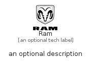

# Ram


```text
simpleicons/R/Ram
```

```text
include('simpleicons/R/Ram')
```


| Illustration | Ram |
| :---: | :---: |
|  |  |


## Sprites
The item provides the following sriptes:

- `<$RamXs>`
- `<$RamSm>`
- `<$RamMd>`
- `<$RamLg>`


## Ram

### Load remotely
```plantuml
@startuml
' configures the library
!global $LIB_BASE_LOCATION="https://raw.githubusercontent.com/tmorin/plantuml-libs/master/distribution"

' loads the library's bootstrap
!include $LIB_BASE_LOCATION/bootstrap.puml

' loads the package bootstrap
include('simpleicons/bootstrap')

' loads the Item which embeds the element Ram
include('simpleicons/R/Ram')

' renders the element
Ram('Ram', 'Ram', 'an optional tech label', 'an optional description')
@enduml
```

### Load locally
```plantuml
@startuml
' configures the library
!global $INCLUSION_MODE="local"
!global $LIB_BASE_LOCATION="../.."

' loads the library's bootstrap
!include $LIB_BASE_LOCATION/bootstrap.puml

' loads the package bootstrap
include('simpleicons/bootstrap')

' loads the Item which embeds the element Ram
include('simpleicons/R/Ram')

' renders the element
Ram('Ram', 'Ram', 'an optional tech label', 'an optional description')
@enduml
```

