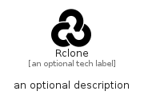

# Rclone


```text
simpleicons/R/Rclone
```

```text
include('simpleicons/R/Rclone')
```


| Illustration | Rclone |
| :---: | :---: |
|  |  |


## Sprites
The item provides the following sriptes:

- `<$RcloneXs>`
- `<$RcloneSm>`
- `<$RcloneMd>`
- `<$RcloneLg>`


## Rclone

### Load remotely
```plantuml
@startuml
' configures the library
!global $LIB_BASE_LOCATION="https://raw.githubusercontent.com/tmorin/plantuml-libs/master/distribution"

' loads the library's bootstrap
!include $LIB_BASE_LOCATION/bootstrap.puml

' loads the package bootstrap
include('simpleicons/bootstrap')

' loads the Item which embeds the element Rclone
include('simpleicons/R/Rclone')

' renders the element
Rclone('Rclone', 'Rclone', 'an optional tech label', 'an optional description')
@enduml
```

### Load locally
```plantuml
@startuml
' configures the library
!global $INCLUSION_MODE="local"
!global $LIB_BASE_LOCATION="../.."

' loads the library's bootstrap
!include $LIB_BASE_LOCATION/bootstrap.puml

' loads the package bootstrap
include('simpleicons/bootstrap')

' loads the Item which embeds the element Rclone
include('simpleicons/R/Rclone')

' renders the element
Rclone('Rclone', 'Rclone', 'an optional tech label', 'an optional description')
@enduml
```

