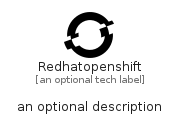

# Redhatopenshift


```text
simpleicons/R/Redhatopenshift
```

```text
include('simpleicons/R/Redhatopenshift')
```


| Illustration | Redhatopenshift |
| :---: | :---: |
|  |  |


## Sprites
The item provides the following sriptes:

- `<$RedhatopenshiftXs>`
- `<$RedhatopenshiftSm>`
- `<$RedhatopenshiftMd>`
- `<$RedhatopenshiftLg>`


## Redhatopenshift

### Load remotely
```plantuml
@startuml
' configures the library
!global $LIB_BASE_LOCATION="https://raw.githubusercontent.com/tmorin/plantuml-libs/master/distribution"

' loads the library's bootstrap
!include $LIB_BASE_LOCATION/bootstrap.puml

' loads the package bootstrap
include('simpleicons/bootstrap')

' loads the Item which embeds the element Redhatopenshift
include('simpleicons/R/Redhatopenshift')

' renders the element
Redhatopenshift('Redhatopenshift', 'Redhatopenshift', 'an optional tech label', 'an optional description')
@enduml
```

### Load locally
```plantuml
@startuml
' configures the library
!global $INCLUSION_MODE="local"
!global $LIB_BASE_LOCATION="../.."

' loads the library's bootstrap
!include $LIB_BASE_LOCATION/bootstrap.puml

' loads the package bootstrap
include('simpleicons/bootstrap')

' loads the Item which embeds the element Redhatopenshift
include('simpleicons/R/Redhatopenshift')

' renders the element
Redhatopenshift('Redhatopenshift', 'Redhatopenshift', 'an optional tech label', 'an optional description')
@enduml
```

