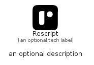

# Rescript


```text
simpleicons/R/Rescript
```

```text
include('simpleicons/R/Rescript')
```


| Illustration | Rescript |
| :---: | :---: |
|  |  |


## Sprites
The item provides the following sriptes:

- `<$RescriptXs>`
- `<$RescriptSm>`
- `<$RescriptMd>`
- `<$RescriptLg>`


## Rescript

### Load remotely
```plantuml
@startuml
' configures the library
!global $LIB_BASE_LOCATION="https://raw.githubusercontent.com/tmorin/plantuml-libs/master/distribution"

' loads the library's bootstrap
!include $LIB_BASE_LOCATION/bootstrap.puml

' loads the package bootstrap
include('simpleicons/bootstrap')

' loads the Item which embeds the element Rescript
include('simpleicons/R/Rescript')

' renders the element
Rescript('Rescript', 'Rescript', 'an optional tech label', 'an optional description')
@enduml
```

### Load locally
```plantuml
@startuml
' configures the library
!global $INCLUSION_MODE="local"
!global $LIB_BASE_LOCATION="../.."

' loads the library's bootstrap
!include $LIB_BASE_LOCATION/bootstrap.puml

' loads the package bootstrap
include('simpleicons/bootstrap')

' loads the Item which embeds the element Rescript
include('simpleicons/R/Rescript')

' renders the element
Rescript('Rescript', 'Rescript', 'an optional tech label', 'an optional description')
@enduml
```

