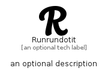

# Runrundotit


```text
simpleicons/R/Runrundotit
```

```text
include('simpleicons/R/Runrundotit')
```


| Illustration | Runrundotit |
| :---: | :---: |
|  |  |


## Sprites
The item provides the following sriptes:

- `<$RunrundotitXs>`
- `<$RunrundotitSm>`
- `<$RunrundotitMd>`
- `<$RunrundotitLg>`


## Runrundotit

### Load remotely
```plantuml
@startuml
' configures the library
!global $LIB_BASE_LOCATION="https://raw.githubusercontent.com/tmorin/plantuml-libs/master/distribution"

' loads the library's bootstrap
!include $LIB_BASE_LOCATION/bootstrap.puml

' loads the package bootstrap
include('simpleicons/bootstrap')

' loads the Item which embeds the element Runrundotit
include('simpleicons/R/Runrundotit')

' renders the element
Runrundotit('Runrundotit', 'Runrundotit', 'an optional tech label', 'an optional description')
@enduml
```

### Load locally
```plantuml
@startuml
' configures the library
!global $INCLUSION_MODE="local"
!global $LIB_BASE_LOCATION="../.."

' loads the library's bootstrap
!include $LIB_BASE_LOCATION/bootstrap.puml

' loads the package bootstrap
include('simpleicons/bootstrap')

' loads the Item which embeds the element Runrundotit
include('simpleicons/R/Runrundotit')

' renders the element
Runrundotit('Runrundotit', 'Runrundotit', 'an optional tech label', 'an optional description')
@enduml
```

