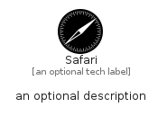

# Safari


```text
simpleicons/S/Safari
```

```text
include('simpleicons/S/Safari')
```


| Illustration | Safari |
| :---: | :---: |
|  |  |


## Sprites
The item provides the following sriptes:

- `<$SafariXs>`
- `<$SafariSm>`
- `<$SafariMd>`
- `<$SafariLg>`


## Safari

### Load remotely
```plantuml
@startuml
' configures the library
!global $LIB_BASE_LOCATION="https://raw.githubusercontent.com/tmorin/plantuml-libs/master/distribution"

' loads the library's bootstrap
!include $LIB_BASE_LOCATION/bootstrap.puml

' loads the package bootstrap
include('simpleicons/bootstrap')

' loads the Item which embeds the element Safari
include('simpleicons/S/Safari')

' renders the element
Safari('Safari', 'Safari', 'an optional tech label', 'an optional description')
@enduml
```

### Load locally
```plantuml
@startuml
' configures the library
!global $INCLUSION_MODE="local"
!global $LIB_BASE_LOCATION="../.."

' loads the library's bootstrap
!include $LIB_BASE_LOCATION/bootstrap.puml

' loads the package bootstrap
include('simpleicons/bootstrap')

' loads the Item which embeds the element Safari
include('simpleicons/S/Safari')

' renders the element
Safari('Safari', 'Safari', 'an optional tech label', 'an optional description')
@enduml
```

