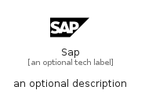

# Sap


```text
simpleicons/S/Sap
```

```text
include('simpleicons/S/Sap')
```


| Illustration | Sap |
| :---: | :---: |
|  |  |


## Sprites
The item provides the following sriptes:

- `<$SapXs>`
- `<$SapSm>`
- `<$SapMd>`
- `<$SapLg>`


## Sap

### Load remotely
```plantuml
@startuml
' configures the library
!global $LIB_BASE_LOCATION="https://raw.githubusercontent.com/tmorin/plantuml-libs/master/distribution"

' loads the library's bootstrap
!include $LIB_BASE_LOCATION/bootstrap.puml

' loads the package bootstrap
include('simpleicons/bootstrap')

' loads the Item which embeds the element Sap
include('simpleicons/S/Sap')

' renders the element
Sap('Sap', 'Sap', 'an optional tech label', 'an optional description')
@enduml
```

### Load locally
```plantuml
@startuml
' configures the library
!global $INCLUSION_MODE="local"
!global $LIB_BASE_LOCATION="../.."

' loads the library's bootstrap
!include $LIB_BASE_LOCATION/bootstrap.puml

' loads the package bootstrap
include('simpleicons/bootstrap')

' loads the Item which embeds the element Sap
include('simpleicons/S/Sap')

' renders the element
Sap('Sap', 'Sap', 'an optional tech label', 'an optional description')
@enduml
```

