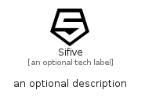

# Sifive


```text
simpleicons/S/Sifive
```

```text
include('simpleicons/S/Sifive')
```


| Illustration | Sifive |
| :---: | :---: |
|  |  |


## Sprites
The item provides the following sriptes:

- `<$SifiveXs>`
- `<$SifiveSm>`
- `<$SifiveMd>`
- `<$SifiveLg>`


## Sifive

### Load remotely
```plantuml
@startuml
' configures the library
!global $LIB_BASE_LOCATION="https://raw.githubusercontent.com/tmorin/plantuml-libs/master/distribution"

' loads the library's bootstrap
!include $LIB_BASE_LOCATION/bootstrap.puml

' loads the package bootstrap
include('simpleicons/bootstrap')

' loads the Item which embeds the element Sifive
include('simpleicons/S/Sifive')

' renders the element
Sifive('Sifive', 'Sifive', 'an optional tech label', 'an optional description')
@enduml
```

### Load locally
```plantuml
@startuml
' configures the library
!global $INCLUSION_MODE="local"
!global $LIB_BASE_LOCATION="../.."

' loads the library's bootstrap
!include $LIB_BASE_LOCATION/bootstrap.puml

' loads the package bootstrap
include('simpleicons/bootstrap')

' loads the Item which embeds the element Sifive
include('simpleicons/S/Sifive')

' renders the element
Sifive('Sifive', 'Sifive', 'an optional tech label', 'an optional description')
@enduml
```

