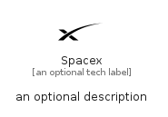

# Spacex


```text
simpleicons/S/Spacex
```

```text
include('simpleicons/S/Spacex')
```


| Illustration | Spacex |
| :---: | :---: |
|  |  |


## Sprites
The item provides the following sriptes:

- `<$SpacexXs>`
- `<$SpacexSm>`
- `<$SpacexMd>`
- `<$SpacexLg>`


## Spacex

### Load remotely
```plantuml
@startuml
' configures the library
!global $LIB_BASE_LOCATION="https://raw.githubusercontent.com/tmorin/plantuml-libs/master/distribution"

' loads the library's bootstrap
!include $LIB_BASE_LOCATION/bootstrap.puml

' loads the package bootstrap
include('simpleicons/bootstrap')

' loads the Item which embeds the element Spacex
include('simpleicons/S/Spacex')

' renders the element
Spacex('Spacex', 'Spacex', 'an optional tech label', 'an optional description')
@enduml
```

### Load locally
```plantuml
@startuml
' configures the library
!global $INCLUSION_MODE="local"
!global $LIB_BASE_LOCATION="../.."

' loads the library's bootstrap
!include $LIB_BASE_LOCATION/bootstrap.puml

' loads the package bootstrap
include('simpleicons/bootstrap')

' loads the Item which embeds the element Spacex
include('simpleicons/S/Spacex')

' renders the element
Spacex('Spacex', 'Spacex', 'an optional tech label', 'an optional description')
@enduml
```

