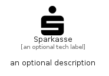

# Sparkasse


```text
simpleicons/S/Sparkasse
```

```text
include('simpleicons/S/Sparkasse')
```


| Illustration | Sparkasse |
| :---: | :---: |
|  |  |


## Sprites
The item provides the following sriptes:

- `<$SparkasseXs>`
- `<$SparkasseSm>`
- `<$SparkasseMd>`
- `<$SparkasseLg>`


## Sparkasse

### Load remotely
```plantuml
@startuml
' configures the library
!global $LIB_BASE_LOCATION="https://raw.githubusercontent.com/tmorin/plantuml-libs/master/distribution"

' loads the library's bootstrap
!include $LIB_BASE_LOCATION/bootstrap.puml

' loads the package bootstrap
include('simpleicons/bootstrap')

' loads the Item which embeds the element Sparkasse
include('simpleicons/S/Sparkasse')

' renders the element
Sparkasse('Sparkasse', 'Sparkasse', 'an optional tech label', 'an optional description')
@enduml
```

### Load locally
```plantuml
@startuml
' configures the library
!global $INCLUSION_MODE="local"
!global $LIB_BASE_LOCATION="../.."

' loads the library's bootstrap
!include $LIB_BASE_LOCATION/bootstrap.puml

' loads the package bootstrap
include('simpleicons/bootstrap')

' loads the Item which embeds the element Sparkasse
include('simpleicons/S/Sparkasse')

' renders the element
Sparkasse('Sparkasse', 'Sparkasse', 'an optional tech label', 'an optional description')
@enduml
```

