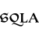
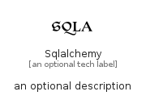

# Sqlalchemy


```text
simpleicons/S/Sqlalchemy
```

```text
include('simpleicons/S/Sqlalchemy')
```


| Illustration | Sqlalchemy |
| :---: | :---: |
|  |  |


## Sprites
The item provides the following sriptes:

- `<$SqlalchemyXs>`
- `<$SqlalchemySm>`
- `<$SqlalchemyMd>`
- `<$SqlalchemyLg>`


## Sqlalchemy

### Load remotely
```plantuml
@startuml
' configures the library
!global $LIB_BASE_LOCATION="https://raw.githubusercontent.com/tmorin/plantuml-libs/master/distribution"

' loads the library's bootstrap
!include $LIB_BASE_LOCATION/bootstrap.puml

' loads the package bootstrap
include('simpleicons/bootstrap')

' loads the Item which embeds the element Sqlalchemy
include('simpleicons/S/Sqlalchemy')

' renders the element
Sqlalchemy('Sqlalchemy', 'Sqlalchemy', 'an optional tech label', 'an optional description')
@enduml
```

### Load locally
```plantuml
@startuml
' configures the library
!global $INCLUSION_MODE="local"
!global $LIB_BASE_LOCATION="../.."

' loads the library's bootstrap
!include $LIB_BASE_LOCATION/bootstrap.puml

' loads the package bootstrap
include('simpleicons/bootstrap')

' loads the Item which embeds the element Sqlalchemy
include('simpleicons/S/Sqlalchemy')

' renders the element
Sqlalchemy('Sqlalchemy', 'Sqlalchemy', 'an optional tech label', 'an optional description')
@enduml
```

