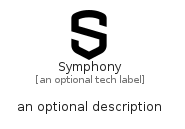

# Symphony


```text
simpleicons/S/Symphony
```

```text
include('simpleicons/S/Symphony')
```


| Illustration | Symphony |
| :---: | :---: |
|  |  |


## Sprites
The item provides the following sriptes:

- `<$SymphonyXs>`
- `<$SymphonySm>`
- `<$SymphonyMd>`
- `<$SymphonyLg>`


## Symphony

### Load remotely
```plantuml
@startuml
' configures the library
!global $LIB_BASE_LOCATION="https://raw.githubusercontent.com/tmorin/plantuml-libs/master/distribution"

' loads the library's bootstrap
!include $LIB_BASE_LOCATION/bootstrap.puml

' loads the package bootstrap
include('simpleicons/bootstrap')

' loads the Item which embeds the element Symphony
include('simpleicons/S/Symphony')

' renders the element
Symphony('Symphony', 'Symphony', 'an optional tech label', 'an optional description')
@enduml
```

### Load locally
```plantuml
@startuml
' configures the library
!global $INCLUSION_MODE="local"
!global $LIB_BASE_LOCATION="../.."

' loads the library's bootstrap
!include $LIB_BASE_LOCATION/bootstrap.puml

' loads the package bootstrap
include('simpleicons/bootstrap')

' loads the Item which embeds the element Symphony
include('simpleicons/S/Symphony')

' renders the element
Symphony('Symphony', 'Symphony', 'an optional tech label', 'an optional description')
@enduml
```

