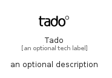

# Tado


```text
simpleicons/T/Tado
```

```text
include('simpleicons/T/Tado')
```


| Illustration | Tado |
| :---: | :---: |
|  |  |


## Sprites
The item provides the following sriptes:

- `<$TadoXs>`
- `<$TadoSm>`
- `<$TadoMd>`
- `<$TadoLg>`


## Tado

### Load remotely
```plantuml
@startuml
' configures the library
!global $LIB_BASE_LOCATION="https://raw.githubusercontent.com/tmorin/plantuml-libs/master/distribution"

' loads the library's bootstrap
!include $LIB_BASE_LOCATION/bootstrap.puml

' loads the package bootstrap
include('simpleicons/bootstrap')

' loads the Item which embeds the element Tado
include('simpleicons/T/Tado')

' renders the element
Tado('Tado', 'Tado', 'an optional tech label', 'an optional description')
@enduml
```

### Load locally
```plantuml
@startuml
' configures the library
!global $INCLUSION_MODE="local"
!global $LIB_BASE_LOCATION="../.."

' loads the library's bootstrap
!include $LIB_BASE_LOCATION/bootstrap.puml

' loads the package bootstrap
include('simpleicons/bootstrap')

' loads the Item which embeds the element Tado
include('simpleicons/T/Tado')

' renders the element
Tado('Tado', 'Tado', 'an optional tech label', 'an optional description')
@enduml
```

