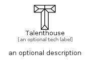

# Talenthouse


```text
simpleicons/T/Talenthouse
```

```text
include('simpleicons/T/Talenthouse')
```


| Illustration | Talenthouse |
| :---: | :---: |
|  |  |


## Sprites
The item provides the following sriptes:

- `<$TalenthouseXs>`
- `<$TalenthouseSm>`
- `<$TalenthouseMd>`
- `<$TalenthouseLg>`


## Talenthouse

### Load remotely
```plantuml
@startuml
' configures the library
!global $LIB_BASE_LOCATION="https://raw.githubusercontent.com/tmorin/plantuml-libs/master/distribution"

' loads the library's bootstrap
!include $LIB_BASE_LOCATION/bootstrap.puml

' loads the package bootstrap
include('simpleicons/bootstrap')

' loads the Item which embeds the element Talenthouse
include('simpleicons/T/Talenthouse')

' renders the element
Talenthouse('Talenthouse', 'Talenthouse', 'an optional tech label', 'an optional description')
@enduml
```

### Load locally
```plantuml
@startuml
' configures the library
!global $INCLUSION_MODE="local"
!global $LIB_BASE_LOCATION="../.."

' loads the library's bootstrap
!include $LIB_BASE_LOCATION/bootstrap.puml

' loads the package bootstrap
include('simpleicons/bootstrap')

' loads the Item which embeds the element Talenthouse
include('simpleicons/T/Talenthouse')

' renders the element
Talenthouse('Talenthouse', 'Talenthouse', 'an optional tech label', 'an optional description')
@enduml
```

