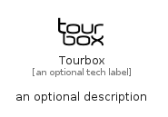

# Tourbox


```text
simpleicons/T/Tourbox
```

```text
include('simpleicons/T/Tourbox')
```


| Illustration | Tourbox |
| :---: | :---: |
|  |  |


## Sprites
The item provides the following sriptes:

- `<$TourboxXs>`
- `<$TourboxSm>`
- `<$TourboxMd>`
- `<$TourboxLg>`


## Tourbox

### Load remotely
```plantuml
@startuml
' configures the library
!global $LIB_BASE_LOCATION="https://raw.githubusercontent.com/tmorin/plantuml-libs/master/distribution"

' loads the library's bootstrap
!include $LIB_BASE_LOCATION/bootstrap.puml

' loads the package bootstrap
include('simpleicons/bootstrap')

' loads the Item which embeds the element Tourbox
include('simpleicons/T/Tourbox')

' renders the element
Tourbox('Tourbox', 'Tourbox', 'an optional tech label', 'an optional description')
@enduml
```

### Load locally
```plantuml
@startuml
' configures the library
!global $INCLUSION_MODE="local"
!global $LIB_BASE_LOCATION="../.."

' loads the library's bootstrap
!include $LIB_BASE_LOCATION/bootstrap.puml

' loads the package bootstrap
include('simpleicons/bootstrap')

' loads the Item which embeds the element Tourbox
include('simpleicons/T/Tourbox')

' renders the element
Tourbox('Tourbox', 'Tourbox', 'an optional tech label', 'an optional description')
@enduml
```

