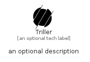

# Triller


```text
simpleicons/T/Triller
```

```text
include('simpleicons/T/Triller')
```


| Illustration | Triller |
| :---: | :---: |
|  |  |


## Sprites
The item provides the following sriptes:

- `<$TrillerXs>`
- `<$TrillerSm>`
- `<$TrillerMd>`
- `<$TrillerLg>`


## Triller

### Load remotely
```plantuml
@startuml
' configures the library
!global $LIB_BASE_LOCATION="https://raw.githubusercontent.com/tmorin/plantuml-libs/master/distribution"

' loads the library's bootstrap
!include $LIB_BASE_LOCATION/bootstrap.puml

' loads the package bootstrap
include('simpleicons/bootstrap')

' loads the Item which embeds the element Triller
include('simpleicons/T/Triller')

' renders the element
Triller('Triller', 'Triller', 'an optional tech label', 'an optional description')
@enduml
```

### Load locally
```plantuml
@startuml
' configures the library
!global $INCLUSION_MODE="local"
!global $LIB_BASE_LOCATION="../.."

' loads the library's bootstrap
!include $LIB_BASE_LOCATION/bootstrap.puml

' loads the package bootstrap
include('simpleicons/bootstrap')

' loads the Item which embeds the element Triller
include('simpleicons/T/Triller')

' renders the element
Triller('Triller', 'Triller', 'an optional tech label', 'an optional description')
@enduml
```

