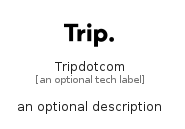

# Tripdotcom


```text
simpleicons/T/Tripdotcom
```

```text
include('simpleicons/T/Tripdotcom')
```


| Illustration | Tripdotcom |
| :---: | :---: |
|  |  |


## Sprites
The item provides the following sriptes:

- `<$TripdotcomXs>`
- `<$TripdotcomSm>`
- `<$TripdotcomMd>`
- `<$TripdotcomLg>`


## Tripdotcom

### Load remotely
```plantuml
@startuml
' configures the library
!global $LIB_BASE_LOCATION="https://raw.githubusercontent.com/tmorin/plantuml-libs/master/distribution"

' loads the library's bootstrap
!include $LIB_BASE_LOCATION/bootstrap.puml

' loads the package bootstrap
include('simpleicons/bootstrap')

' loads the Item which embeds the element Tripdotcom
include('simpleicons/T/Tripdotcom')

' renders the element
Tripdotcom('Tripdotcom', 'Tripdotcom', 'an optional tech label', 'an optional description')
@enduml
```

### Load locally
```plantuml
@startuml
' configures the library
!global $INCLUSION_MODE="local"
!global $LIB_BASE_LOCATION="../.."

' loads the library's bootstrap
!include $LIB_BASE_LOCATION/bootstrap.puml

' loads the package bootstrap
include('simpleicons/bootstrap')

' loads the Item which embeds the element Tripdotcom
include('simpleicons/T/Tripdotcom')

' renders the element
Tripdotcom('Tripdotcom', 'Tripdotcom', 'an optional tech label', 'an optional description')
@enduml
```

