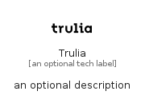

# Trulia


```text
simpleicons/T/Trulia
```

```text
include('simpleicons/T/Trulia')
```


| Illustration | Trulia |
| :---: | :---: |
|  |  |


## Sprites
The item provides the following sriptes:

- `<$TruliaXs>`
- `<$TruliaSm>`
- `<$TruliaMd>`
- `<$TruliaLg>`


## Trulia

### Load remotely
```plantuml
@startuml
' configures the library
!global $LIB_BASE_LOCATION="https://raw.githubusercontent.com/tmorin/plantuml-libs/master/distribution"

' loads the library's bootstrap
!include $LIB_BASE_LOCATION/bootstrap.puml

' loads the package bootstrap
include('simpleicons/bootstrap')

' loads the Item which embeds the element Trulia
include('simpleicons/T/Trulia')

' renders the element
Trulia('Trulia', 'Trulia', 'an optional tech label', 'an optional description')
@enduml
```

### Load locally
```plantuml
@startuml
' configures the library
!global $INCLUSION_MODE="local"
!global $LIB_BASE_LOCATION="../.."

' loads the library's bootstrap
!include $LIB_BASE_LOCATION/bootstrap.puml

' loads the package bootstrap
include('simpleicons/bootstrap')

' loads the Item which embeds the element Trulia
include('simpleicons/T/Trulia')

' renders the element
Trulia('Trulia', 'Trulia', 'an optional tech label', 'an optional description')
@enduml
```

