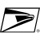

# U

The module contains 52 items.

| |Name|
|:---:|---|
|  | [simpleicons/U/Uber](../../simpleicons/U/Uber.md) |
|  | [simpleicons/U/Ubereats](../../simpleicons/U/Ubereats.md) |
|  | [simpleicons/U/Ubiquiti](../../simpleicons/U/Ubiquiti.md) |
|  | [simpleicons/U/Ubisoft](../../simpleicons/U/Ubisoft.md) |
|  | [simpleicons/U/Ublockorigin](../../simpleicons/U/Ublockorigin.md) |
|  | [simpleicons/U/Ubuntu](../../simpleicons/U/Ubuntu.md) |
|  | [simpleicons/U/Ubuntumate](../../simpleicons/U/Ubuntumate.md) |
|  | [simpleicons/U/Udacity](../../simpleicons/U/Udacity.md) |
|  | [simpleicons/U/Udemy](../../simpleicons/U/Udemy.md) |
|  | [simpleicons/U/Udotsdotnews](../../simpleicons/U/Udotsdotnews.md) |
|  | [simpleicons/U/Ufc](../../simpleicons/U/Ufc.md) |
|  | [simpleicons/U/Uikit](../../simpleicons/U/Uikit.md) |
|  | [simpleicons/U/Uipath](../../simpleicons/U/Uipath.md) |
|  | [simpleicons/U/Ukca](../../simpleicons/U/Ukca.md) |
|  | [simpleicons/U/Ultralytics](../../simpleicons/U/Ultralytics.md) |
|  | [simpleicons/U/Ulule](../../simpleicons/U/Ulule.md) |
|  | [simpleicons/U/Umami](../../simpleicons/U/Umami.md) |
|  | [simpleicons/U/Umbraco](../../simpleicons/U/Umbraco.md) |
|  | [simpleicons/U/Umbrel](../../simpleicons/U/Umbrel.md) |
|  | [simpleicons/U/Uml](../../simpleicons/U/Uml.md) |
|  | [simpleicons/U/Unacademy](../../simpleicons/U/Unacademy.md) |
|  | [simpleicons/U/Underarmour](../../simpleicons/U/Underarmour.md) |
|  | [simpleicons/U/Underscoredotjs](../../simpleicons/U/Underscoredotjs.md) |
|  | [simpleicons/U/Undertale](../../simpleicons/U/Undertale.md) |
|  | [simpleicons/U/Unicode](../../simpleicons/U/Unicode.md) |
|  | [simpleicons/U/Unilever](../../simpleicons/U/Unilever.md) |
|  | [simpleicons/U/Uniqlo](../../simpleicons/U/Uniqlo.md) |
|  | [simpleicons/U/UniqloJa](../../simpleicons/U/UniqloJa.md) |
|  | [simpleicons/U/Unitedairlines](../../simpleicons/U/Unitedairlines.md) |
|  | [simpleicons/U/Unitednations](../../simpleicons/U/Unitednations.md) |
|  | [simpleicons/U/Unity](../../simpleicons/U/Unity.md) |
|  | [simpleicons/U/Unjs](../../simpleicons/U/Unjs.md) |
|  | [simpleicons/U/Unlicense](../../simpleicons/U/Unlicense.md) |
|  | [simpleicons/U/Unocss](../../simpleicons/U/Unocss.md) |
|  | [simpleicons/U/Unpkg](../../simpleicons/U/Unpkg.md) |
|  | [simpleicons/U/Unraid](../../simpleicons/U/Unraid.md) |
|  | [simpleicons/U/Unrealengine](../../simpleicons/U/Unrealengine.md) |
|  | [simpleicons/U/Unsplash](../../simpleicons/U/Unsplash.md) |
|  | [simpleicons/U/Unstop](../../simpleicons/U/Unstop.md) |
|  | [simpleicons/U/Untappd](../../simpleicons/U/Untappd.md) |
|  | [simpleicons/U/Upcloud](../../simpleicons/U/Upcloud.md) |
|  | [simpleicons/U/Uphold](../../simpleicons/U/Uphold.md) |
|  | [simpleicons/U/Uplabs](../../simpleicons/U/Uplabs.md) |
|  | [simpleicons/U/Upptime](../../simpleicons/U/Upptime.md) |
|  | [simpleicons/U/Ups](../../simpleicons/U/Ups.md) |
|  | [simpleicons/U/Upstash](../../simpleicons/U/Upstash.md) |
|  | [simpleicons/U/Uptimekuma](../../simpleicons/U/Uptimekuma.md) |
|  | [simpleicons/U/Upwork](../../simpleicons/U/Upwork.md) |
|  | [simpleicons/U/Uservoice](../../simpleicons/U/Uservoice.md) |
|  | [simpleicons/U/Usps](../../simpleicons/U/Usps.md) |
|  | [simpleicons/U/Utorrent](../../simpleicons/U/Utorrent.md) |
|  | [simpleicons/U/Uv](../../simpleicons/U/Uv.md) |

