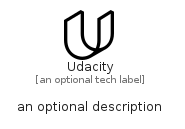

# Udacity


```text
simpleicons/U/Udacity
```

```text
include('simpleicons/U/Udacity')
```


| Illustration | Udacity |
| :---: | :---: |
|  |  |


## Sprites
The item provides the following sriptes:

- `<$UdacityXs>`
- `<$UdacitySm>`
- `<$UdacityMd>`
- `<$UdacityLg>`


## Udacity

### Load remotely
```plantuml
@startuml
' configures the library
!global $LIB_BASE_LOCATION="https://raw.githubusercontent.com/tmorin/plantuml-libs/master/distribution"

' loads the library's bootstrap
!include $LIB_BASE_LOCATION/bootstrap.puml

' loads the package bootstrap
include('simpleicons/bootstrap')

' loads the Item which embeds the element Udacity
include('simpleicons/U/Udacity')

' renders the element
Udacity('Udacity', 'Udacity', 'an optional tech label', 'an optional description')
@enduml
```

### Load locally
```plantuml
@startuml
' configures the library
!global $INCLUSION_MODE="local"
!global $LIB_BASE_LOCATION="../.."

' loads the library's bootstrap
!include $LIB_BASE_LOCATION/bootstrap.puml

' loads the package bootstrap
include('simpleicons/bootstrap')

' loads the Item which embeds the element Udacity
include('simpleicons/U/Udacity')

' renders the element
Udacity('Udacity', 'Udacity', 'an optional tech label', 'an optional description')
@enduml
```

